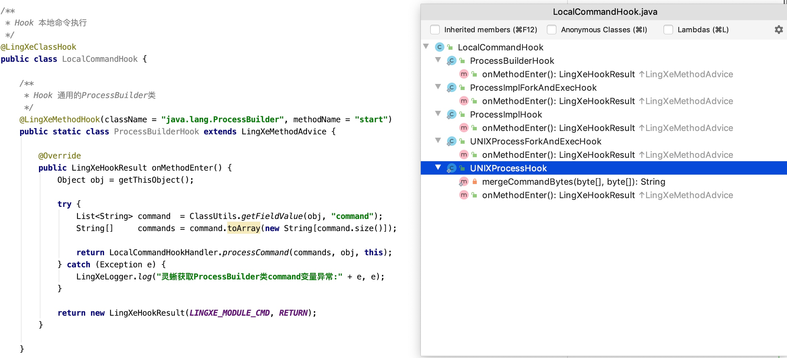
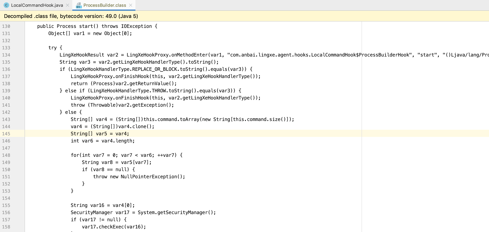
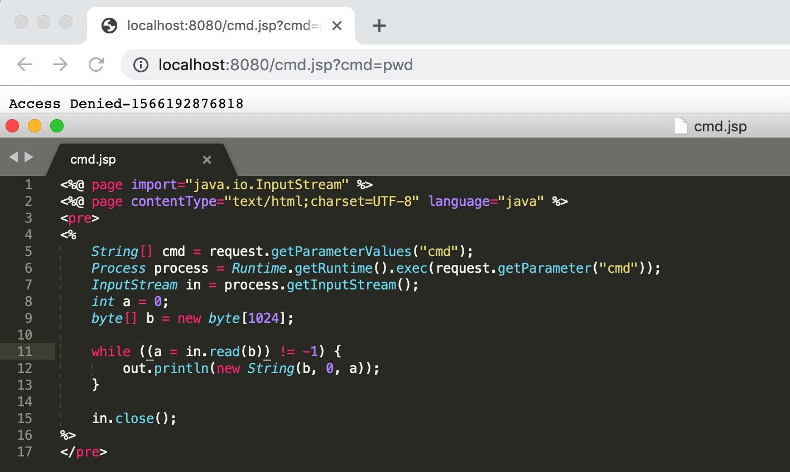
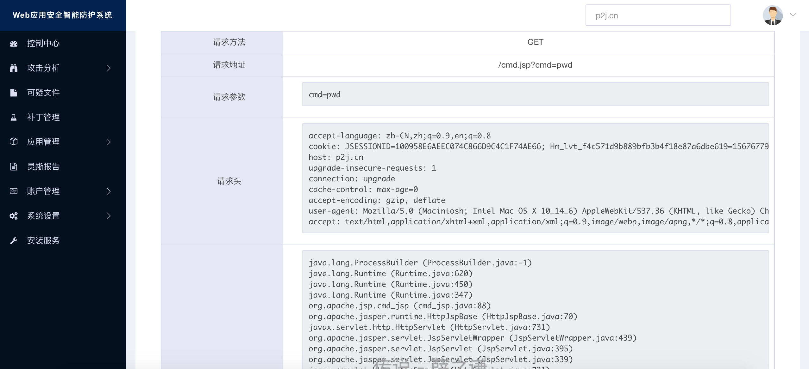

# 基于Java Agent实现的灵蜥RASP技术研究

## 一、什么是RASP技术?

> 最近三五年RASP技术已日渐被人们所接收，国内的各大安全厂商也在不断的完善自身产品。RASP技术触及到了应用程序的底层实现，如何实现一款高稳定性和高可用的RASP产品也就变得比较困难了。

在2013年的时候乌云研发了应该是国内第一款商业`RASP产品`：`防护云`。借助于PHP的`auto_prepend_file`和Java的`Filter`特性我们实现了这两种语言层的攻击防御。在2014年`RASP`（`Runtime application self-protection`运行时应用自我保护）技术提出之前“防护云”早就已经实现了基于客户端拦截和云端可视化分析为一体化的安全防御系统研发。

但是这种基于请求过滤(Filter)机制实现的防御相较于传统的WAF已经有了较大的能力提升，但也因为其建立在请求过滤的基础上的实现导致了防御的深度和准确性还是不够，而且基于Filter实现的RASP本身也会有非常多的坑。为了解决这个问题2016年的时候我开始了基于JavaAgent机制的`灵蜥RASP`技术研究，希望通过增强Java语言底层的API来实现更加深层次的防御。

### 1.1 RASP简介

`Runtime application self-protection`一词，简称为RASP。它是一种新型应用安全保护技术，它将保护程序像疫苗一样注入到应用程序中，应用程序融为一体，能实时检测和阻断安全攻击，使应用程序具备自我保护能力。当应用程序遭受到实际攻击伤害，就可以自动对其进行防御，而不需要进行人工干预。

RASP技术可以快速的将安全防御功能整合到正在运行的应用程序中，它拦截从应用程序到系统的所有调用，确保它们是安全的，并直接在应用程序内验证数据请求。Web和非Web应用程序都可以通过RASP进行保护。该技术不会影响应用程序的设计，因为RASP的检测和保护功能是在应用程序运行的系统上运行的。

## 二、Java Agent 机制探索

### 1. Java Agent运行机制

> JDK1.5开始引入了Agent机制(即启动java程序时添加`-javaagent`参数”,如`java -javaagent:/data/test.jar LingXeTest`)，`Java Agent`机制允许用户在JVM加载class文件的时候先加载自己编写的Agent文件，通过修改JVM传入的字节码来实现注入`RASP`防御逻辑。这种方式因为必须是在容器启动时添加jvm参数,所以需要重启Web容器。JDK1.6新增了`attach`方式(`agentmain`)，可以对运行中的java进程附加agent。使用附加的方式可以在容器运行时动态的注入`RASP`防御逻辑。 

使用在应用启动时加入`-javaagent`参数的方式适用于`RASP`常驻用户应用的防御方式,也是我们目前最常用的安装集成方式。但是正因为必须在应用程序启动时加上我们自定义的`-javaagent`参数所以也就会不得不要求用户重启Web容器，一些生产环境的服务是不允许停止的，所以重启问题成了其重大阻碍。

为了解决应用重启问题，我使用了`attach`灵蜥Agent到Java进程的方式来实现防御，当然`attach`和`agent`方式并无太大的差异，只是实现方式会有细微的差别，麻烦的是`attach`需要考虑如何避免重复加载、如何完整的卸载等问题。

### 1.1 LingXeClassFileTransformer示例

我们通过实现`java.lang.instrument.ClassFileTransformer`类并重写`transform`方法即可拿到JVM等待加载的类的`className`(类名)、`classFileBuffer`(字节码)、`classLoader`(类加载器)、`classBeingRedefined`(重定义或重转换的类)、`protectionDomain`(受保护域)。通过ASM字节码库,我们可以完成对JVM传入的字节码的修改工作。只需要在我们预先设定好的类方法处添加防御代码即可实现深入防御。

```java
import java.lang.instrument.ClassFileTransformer;
import java.security.ProtectionDomain;

public class LingXeClassFileTransformer implements ClassFileTransformer {

	/**
	 * 重写transform方法可获取到待加载的类相关信息
	 *
	 * @param loader              定义要转换的类加载器；如果是引导加载器，则为 null
	 * @param className           类名,如:java/lang/Runtime
	 * @param classBeingRedefined 如果是被重定义或重转换触发，则为重定义或重转换的类；如果是类加载，则为 null
	 * @param protectionDomain    要定义或重定义的类的保护域
	 * @param classfileBuffer     类文件格式的输入字节缓冲区（不得修改）
	 * @return 返回一个通过ASM修改后添加了防御代码的字节码byte数组。
	 */
	public byte[] transform(ClassLoader loader, String className, Class<?> classBeingRedefined,
	                        ProtectionDomain protectionDomain, byte[] classfileBuffer) {

		return 通过ASM修改后的字节码;
	}

}
```

### 2. 利用Java Agent机制能做什么?

因为使用`Java Agent`可以深入到JVM类加载机制,所以我们可以轻松的在任意的类方法中插入自己的java代码。比如我们在`java.io.FileOutputStream`类的构造方法里面插入了防御代码就可以获取到用户即将写入的文件路径，拿到文件路径后就可以交给`灵蜥RASP`去检测文件名是否合法？如果写入了非法文件我们可以直接`return`或者`throw`来终止恶意文件的写入。

**经过RASP修改后的FileOutputStream示例**

```java
package com.anbai.lingxe.agent;

import com.anbai.lingxe.agent.hooks.LingXeHookResult;

import java.io.File;
import java.io.FileNotFoundException;
import java.io.OutputStream;

public class FileOutputStream extends OutputStream {

	public FileOutputStream(File file, boolean append) throws FileNotFoundException {
		Object[] var3 = new Object[]{file, append};

		try {
			LingXeHookResult var4 = 灵蜥RASP调用.onMethodEnter(var3, 其他必要参数);

			if (灵蜥处理结果检测) {
				根据RASP返回的结果对象自动return/throw等操作。
			} else {
				FileOutputStream原始逻辑代码...
			}
		} catch (Throwable var12) {
			封装异常处理,防止因为自身异常导致程序无法正常执行的情况。
		}
	}
	
}
```

通过`Hook`机制我们可以实现对大部分可能会存在安全的Java代码实现防御，如：

1. 文件系统防御(目录遍历、文件读、写、重命名、移动等)。
2. SQL查询防御。
3. XML实体注入防御。
4. 恶意表达式执行防御(Ognl、SpEL、MVEL2等)。
5. 恶意WebShell请求拦截。
6. 恶意文件上传。
7. 本地命令执行。
8. 反序列化攻击(Java、XML、Json)。
9. SSRF攻击。
10. 其他类型攻击...。

但是还有一些类型的攻击不太适合使用Hook机制来实现，如：XSS、动态补丁等功能，至于为什么后面的分析会给出答案。

通过上述示例程序可能很多人就会觉得不就是一个程序语言级别的`AOP机制`吗？我们只要实现一套适用于字节码的AOP机制就可以成功的搞定Hook机制了，写个RASP产品似乎没什么难度。

诚然，基于`Java Agent`机制的`RASP`产品核心实现的确是如此简单，我们需要通过预定义大量的Hook点来插入我们防御逻辑从而实现深入的防御。但是仅有此想法恐怕仅仅只能做出一个非常粗浅的甚至存在非常多安全性和稳定性的产品了，因为这个过程中会有非常多的坑需要踩的。`RASP`的核心技术依赖于`Hook`但是绝不仅仅只是`Hook`那么简单。

如果你不知道如何通过Java Agent实现Hook Java方法，可以参考我们之前发的文章的Demo：

1. [Java SpEL、Ognl、MVEL2表达式Hook项目](http://javaweb.org/?p=1862)
2. [javaweb-expression](https://github.com/anbai-inc/javaweb-expression)
3. [javaweb-codereview](https://github.com/anbai-inc/javaweb-codereview/tree/master/javaweb-codereview-agent)
4. [浅谈RASP技术攻防之基础篇](https://javaweb.org.cn/3237.shtml)
5. [浅谈RASP技术攻防之实战[环境配置篇]](https://javaweb.org.cn/3238.shtml)
6. [浅谈RASP技术攻防之实战[代码实现篇]](https://javaweb.org.cn/3239.shtml)


### 3. 如何更好的实现方法Hook机制?

#### 3.1 Hook点的深度问题

我们常用的Hook思路大概是这样:

1. 确定需要Hook的类名,如:`java.lang.Runtime`.
2. 指定需要Hook的方法和方法描述符，如指定方法名`exec`以及描述符`(Ljava/lang/String;)Ljava/lang/Process;`。

这是一种非常典型的对`Runtime`本地命令执行的Hook点，很多人对Java本地命令执行的认识可能也就局限于此；但是跟进`Runtime.getRuntime().exec(xxx)`的调用链可以清晰的看到其最终是调用了`java.lang.ProcessBuilder`类的`start`方法、`start`方法最终又调用了`java.lang.ProcessImpl.start(xxx)`方法、最终调用到`java.lang.UNIXProcess`类(Unix系统是这个，不同的文件系统实现方法不一样)的native方法：`forkAndExec`去执行的系统命令的。所以只是对上层的`Runtime`或者`ProcessBuilder`类进行Hook是远远不够的，攻击者只需要调用更为底层的实现代码即可绕过Hook。

**java.lang.Runtime本地命令执行调用链**

```java
at java.lang.ProcessBuilder.start(ProcessBuilder.java:1047)
at java.lang.Runtime.exec(Runtime.java:617)
at java.lang.Runtime.exec(Runtime.java:450)
at java.lang.Runtime.exec(Runtime.java:347)
at java.lang.UNIXProcess.forkAndExec(Native Method)
at java.lang.UNIXProcess.<init>(UNIXProcess.java:185)
at java.lang.ProcessImpl.start(ProcessImpl.java:130)
at java.lang.ProcessBuilder.start(ProcessBuilder.java:1028)
```

与之类似的还有java的文件操作，初级的做法是直接Hook掉`java.io.File`、`java.io.FileInputStream`、`java.io.FileOutputStream`就完事了，但是当你深入研究过Java文件系统后就会发现能够实现文件读写的API不下十处。如：`java.io.RandomAccessFile`、`sun.nio.ch.FileChannelImpl`、`sun.nio.fs.UnixChannelFactory`、`(Windows|Unix)FileSystemProvider`等。

定义一个Hook点之前需要完整的跟一下调用链，否则攻击者可以直接调用底层的API绕过防御。值得注意的是Java语言可以通过`JNI`(`Java Native Interface`)调用动态链接库的方式绕过防御机制，所以需要想办法解决`JNI`的`native`方法调用的安全问题。

Java文件读写底层都是通过JNI调用的，攻击者可以通过反射去调用`native`方法从而会导致Hook被绕过，如：`java.io.RandomAccessFile#read0`,所以还需要考虑`Java反射机制`+`JNI`的安全问题。

#### 3.2 Hook机制进阶

掌握了Hook机制我们就可以轻松的实现大部分的API Hook，但是如果想要足够的深入那么最起码还要实现如下几点：

1. Hook点类名、方法名、方法描述法支持正则表达式或者通配符(为了批量处理类或方法同逻辑的Hook点)。
2. 支持对类、方法级的注解Hook。
3. 支持对`一个类的子类或接口实现类的方法`Hook。
4. 支持对`Java Native`方法的Hook。

以上几个问题看似需求很简单，但是实现起来是挺有难度的，不过经过一段时间的优化目前都已经搞定了。

##### 3.2.1 Hook点通配符问题

某些需要Hook的类存在多个不一样的命名但是却实现却大致上是一样的类，如：`java.io.*FileSystem`（不同的文件系统类名不一样，如Windows、Unix等）、`*.fileupload.FileUploadBase`(Tomcat自己内置了`commons-fileupload`库但是包名不一样)。方法名和方法描述符同理，比如使用方法描述法正则匹配可以解决多个方法名相同方法参数入参不同且调用链不一样的需求需要重复定义Hook点的问题。

##### 3.2.2 Java注解Hook

Java注解目前已经广泛的被用于替换传统的xml配置，比如`Spring`的注解已经被广泛的接受了,基于SpringBoot的应用更是极大程度的依赖着注解，所以我们有必要考虑下对注解的类方法Hook问题。

我目前主要使用`Hook Annotation`的方式来Hook `Spring MVC`的控制器来实现对Spring框架的增强。

##### 3.2.3 RASP核心-子类方法Hook

某些时候我们需要拦截JDBC执行的SQL语句的时候我们可能需要去Hook JDBC的查询方法。很多人的处理方式是直接去适配单个数据库的实现，这样一来就变得非常麻烦了，因为你不得不考虑适配每一个数据库、兼容每一个数据库的版本。但是如果我们通过Hook接口方法可以轻易的拦截到其实现类而不再需要去考虑数据库适配、数据库版本适配的问题了。

例如我们需要Hook `java.sql.Connection`类的`prepareStatement`方法那么我们就不再需要去找出它的实现类有哪些，而是通过Agent自动待加载的类是否是其子类。如Agent在加载到 `com.mysql.jdbc.ConnectionImpl`类时我们通过ASM检测到了方法名`prepareStatement`和描述符和我们定义的Hook完全一致，那么我们就可以直接判定这个`com.mysql.jdbc.ConnectionImpl`就是需要被我们动态Hook的类直接插入防御代码就行了，通过这一方法成功的解决了手动找出实现类和方法的困难，同时也极大的提高了Hook机制的灵活度。

在2016年研发灵蜥`Java Agent`的第一个版本的时候我就已经考虑了这个问题，当时想通过直接反射的方式来实现父类检测，结果遇到了反射的类可能并未被JVM加载导致异常的问题。第二个版本的时候我使用的方法是给`疑似的Hook点`(方法名和方法描述符都一直的类方法)动态插入父类检测代码来实现子类Hook的。如今灵蜥的第三个版本已经解决了第一个版本的类加载问题，所以也就不在需要利用动态代码检测的方式判断了。

子类方法Hook的实现能够极大的提高Hook机制的灵活性，灵蜥Agent通过对Java的标准的`JDBC`、`Java Servlet`等的接口API进行Hook从而实现了如下重要特性：

1. **理论上支持所有实现了标准的JDBC的数据库。**
2. **理论上支持所有实现了标准的`Java Servlet API`的Java容器。**

##### 3.2.4 RASP核心-Native方法Hook

Java语言底层实现有很多地方都是通过调用native方法来实现的，比较典型的如：`文件的读写`、`本地命令执行`等。因为对API的Hook无法阻止攻击者使用反射或其他机制直接调用jni方法，所以我们有必要连同native方法的调用也一起Hook了。

JDK1.6开始`Java Agent`可以通过设置`Native-Method-Prefix`的方式为所有的native方法设置前缀，利用了这个特性以后我使用了纯Java实现了对native方法的Hook，如此以来也就不用担心jni方法调用问题了。

#### 4. 灵蜥Agent Hook示例

灵蜥通过多层的封装让我们定义和处理Hook点已经完全不需要了解ASM了，我觉得为写Hook点的人屏蔽掉学习ASM和Agent的成本才能够让Agent实现得更加稳定。

这里以Java调用本地系统命令的Hook机制为例，很多人都知道Java可以通过`Runtime.getRuntime().exec()`去执行系统命令，但是很少有人去真正的看了整个调用链，以为只需要Hook `java.lang.Runtime`或者`java.lang.ProcessBuilder`就可以了，其实还需要关注其最终执行的类，如：`UNIXProcess`、`ProcessImpl`否则就可以绕过，Java最终会调用一个叫`forkAndExec`的native方法去执行系统命令，所以我们如果想一步到位就直接Hook这个native方法就行了，这里我为了以防万一Hook了多个点。

**com.anbai.lingxe.agent.hooks.LocalCommandHook.java示例**



当`java.lang.ProcessBuilder`或其他的Hook类被攻击者访问时候会通过agent添加上灵蜥的安全防御逻辑，最终执行的`ProcessBuilder`类的原代码大致如下图所示代码：



如果某个恶意请求最终触发了本地命令执行Hook点，那么该请求最终会被终止访问：



同时客户端也会将攻击日志回传给云端进行可视化展示&预警通知。



在云端用户可以清晰的看到攻击者的请求参数、请求头以及调用链等信息。
